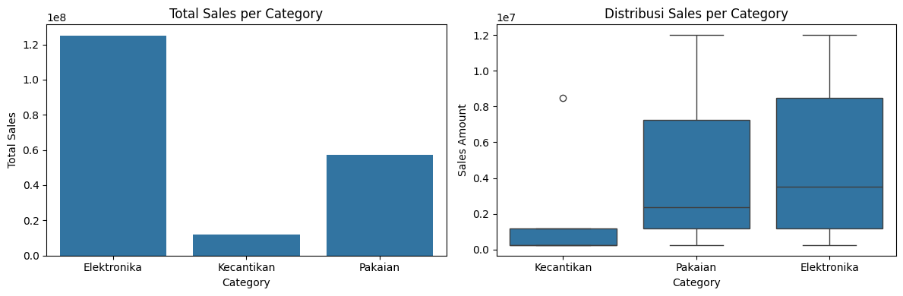

# End-to-End Python EDA and Outlier Detection Report



## Business Problem and Context

TokoKita required a programmatically scalable solution to clean transactional logs, evaluate product performance metrics, analyze value distributions, and detect transactional anomalies. Manual inspection and static reporting tools were insufficient for detecting subtle statistical outliers and evaluating distribution spreads across multiple sales dimensions.

The objective of this project was to construct an end-to-end Python analytics pipeline using Pandas, NumPy, Matplotlib, and Seaborn. The pipeline ingests transactional datasets, isolates valid completed orders, computes aggregate performance statistics, and renders comparative visualizations to uncover structural revenue drivers and high-value customer anomalies.

## Dataset Overview

The dataset consists of 50 synthesized e-commerce transaction logs generated for exploratory data analysis (EDA) and distribution testing.

* Total Records: 50 orders
* Primary Libraries: Pandas, NumPy, Matplotlib, Seaborn
* Target Variables: `Sales_Amount`, `Category`, `Payment_Status`

### Data Dictionary

* `Transaction_ID`: Unique string identifier for each order (e.g., TRX-1001)
* `Category`: Product group classification (Elektronika, Pakaian, Kecantikan)
* `Region`: Customer geographical zone (Jakarta, Bandung, Surabaya, Medan)
* `Sales_Amount`: Gross monetary transaction value in IDR
* `Payment_Status`: Fulfillment status flag (SUCCESS, FAILED)

## Methodology and Python Implementation

### 1. Data Cleaning and Manipulation (Pandas)

Extracted successful transaction records, appended tax calculations (11% VAT), and calculated categorical aggregations using `.groupby()` and `.agg()`. Explicit DataFrame copying (`.copy()`) was implemented to prevent `SettingWithCopyWarning` memory allocation errors.

```python
import pandas as pd
import numpy as np
import matplotlib.pyplot as plt
import seaborn as sns

# Seed untuk konsistensi data
np.random.seed(42)

# Buat Dataset Sintetis
n = 50
categories = ['Elektronika', 'Pakaian', 'Kecantikan']
regions = ['Jakarta', 'Bandung', 'Surabaya', 'Medan']

data = {
    'Transaction_ID': [f'TRX-{1000+i}' for i in range(n)],
    'Category': np.random.choice(categories, n, p=[0.4, 0.3, 0.3]),
    'Region': np.random.choice(regions, n),
    'Sales_Amount': np.random.choice([250000, 500000, 1200000, 3500000, 8500000, 12000000], n),
    'Payment_Status': np.random.choice(['SUCCESS', 'FAILED'], n, p=[0.8, 0.2])
}

df = pd.DataFrame(data)

# Filter data
df_success = df[df['Payment_Status'] == 'SUCCESS'].copy()

# Add 11% Tax Calculation
df_success['Tax'] = df_success['Sales_Amount'] * 0.11
```

### 2. Categorical Summary
```
# Categorical Aggregation
category_summary = (
    df_success.groupby('Category')['Sales_Amount']
    .agg(['sum', 'mean', 'count'])
    .reset_index()
)

category_summary['sum'] = category_summary['sum'].apply(lambda x: f"{x:,.0f}")
category_summary['mean'] = category_summary['mean'].apply(lambda x: f"{x:,.2f}")
print(category_summary)
```

| Category | Sum | Mean | Count |
| :--- | :--- | :--- | :--- |
| Elektronika | Rp 125.050.000 | Rp 5.436.956,52 | 23 |
| Kecantikan | Rp 11.900.000 | Rp 1.700.000,00 | 7 |
| Pakaian | Rp 57.300.000 | Rp 4.092.857,14 | 14 |

### 3. Exploratory Data Visualization Pipeline
Constructed side-by-side subplot figures combining a categorical bar plot and Seaborn boxplots to evaluate total revenue contribution alongside value distribution spreads and outliers.

```
# Group & Chart
fig, (ax1, ax2) = plt.subplots(1, 2, figsize=(12, 4))

category_sales = df_success.groupby('Category')['Sales_Amount'].sum().reset_index()
sns.barplot(data=category_sales, x='Category', y='Sales_Amount', ax=ax1)
ax1.set_title("Total Sales per Category")
ax1.set_xlabel('Category')
ax1.set_ylabel('Total Sales')

# Distribusi sales
sns.boxplot(data=df_success, x='Category', y='Sales_Amount', ax=ax2)
ax2.set_title("Distribusi Sales per Category")
ax2.set_xlabel('Category')
ax2.set_ylabel('Sales Amount')

plt.tight_layout()
plt.show()
```


## Key Insights and Visual Analysis
1. Revenue Concentration in Electronics
The bar plot analysis demonstrates that Elektronika overwhelmingly dominates total platform sales, accumulating over Rp125,000,000 in gross revenue. Pakaian follows second (~Rp57,350,000), while Kecantikan represents the lowest cumulative sales channel (~Rp12,100,000).
2. High Basket Value Spread in Core Categories
Boxplot analysis reveals that Elektronika and Pakaian exhibit wide Interquartile Ranges (IQR) and high median transaction values (~Rp3,500,000 and ~Rp2,400,000 respectively). Their upper whiskers reach the maximum item price of Rp12,000,000, confirming consistent high-ticket purchasing behavior.
3. Outlier Identification in Secondary Categories
The boxplot specifically highlighted an extreme statistical outlier in the Kecantikan category (represented by an isolated data point at Rp8,500,000). While the overall median transaction value for Kecantikan remains low (~Rp250,000 to Rp1,200,000), this outlier proves the existence of occasional premium buyers within lower-tier merchandise lines.

## Business Recommendations
* Capitalize on High Median Basket Sizes: Double down on inventory expansion and promotional coverage for Elektronika and Pakaian, as their high median transaction values drive the majority of platform gross merchandise value (GMV).
* Target Premium Outlier Segments: Investigate customer profiles associated with high-value transactional outliers in lower-priced categories (e.g., the Rp8.5M Kecantikan purchase). Develop targeted luxury/bulk product bundles to convert these anomalous high spenders into a permanent customer segment.
* Automate Outlier Monitoring Pipelines: Integrate automated IQR-based or Z-score outlier detection scripts into backend analytics pipelines to flag anomalous high-value transactions in real time for fraud verification or VIP marketing routing.


